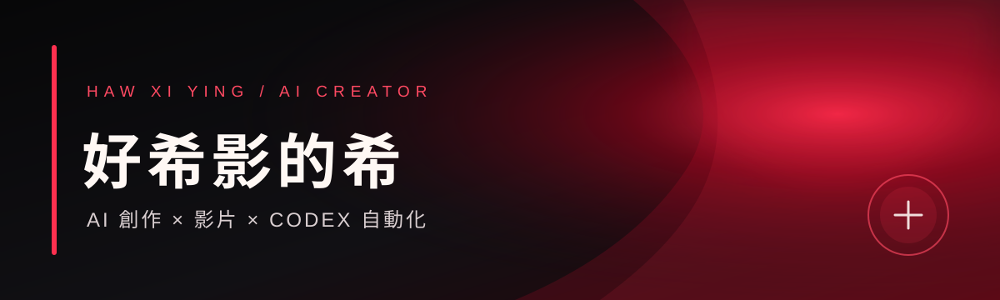

<!--
THESIS: 把 GitHub 個人頁做成一張可被記住的紅色電影海報，而不是徽章與技術清單。
OWN-WORLD: 深黑底、電影紅大色塊、銀白文字、窄幅分鏡與真實作品畫面。
STORY: 訪客先記住「好希影的希」，再理解 AI 影片創作定位，最後觀看代表作或加入 LINE。
FIRST VIEWPORT: 橫幅姓名海報置頂；下一段由直式人像與一句定位形成不對稱雙欄，兩個明確行動緊跟其後。
FORM: Experience 模式的創作者片頭／片尾字幕系統；seed key profile-red-credit-roll。
FINISH: unreviewed and undocumented is unfinished; this build ends with the finish review, the verdict, and DESIGN.md
-->

  

<table>
  <tr>
    <td width="34%" valign="top">
      
    </td>
    <td width="66%" valign="middle">
      <h1>好希影的希</h1>
      <h3>AI 創作者 × 影片 × Codex 自動化</h3>
      

        我把音樂、故事與 AI 視覺，做成會呼吸、會跟著聲音跳動的影像作品。 
        目前專注於動態歌詞 MV、音訊反應式視覺與可重用的創作工作流。
      

      

        <a href="https://github.com/hawxiying-commits/cinematic-lyrics-mv"><strong>觀看代表作 →</strong></a>
        &nbsp;&nbsp;·&nbsp;&nbsp;
        <a href="https://line.me/R/ti/p/@337efhll"><strong>LINE 官方帳號 →</strong></a>
      

    </td>
  </tr>
</table>

 

  

  

### 🎬 Cinematic Lyrics MV

一首音樂 + 一份歌詞，讓 Codex 幫你製作電影感、音訊反應式的動態歌詞 MV。

- 三句歌詞柔和輪播：漸顯 → 停留 → 漸隱
- 波形依 RMS、低頻、中頻、高頻真正跟著音樂反應
- 電影光影、微粒、播放器、時間軌與多種橫直式版型
- 可重用的 Codex Plugin / Skill，最終輸出 1080p MP4

  <a href="https://github.com/hawxiying-commits/cinematic-lyrics-mv"><strong>進入專案、查看 Demo 與使用方式 →</strong></a>

 

  

  MADE WITH AI, STORY &amp; A LITTLE RED LIGHT.

